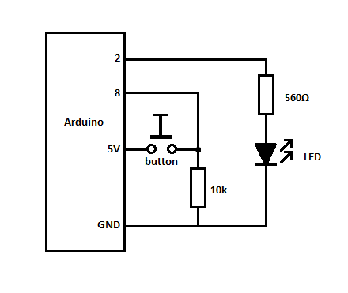
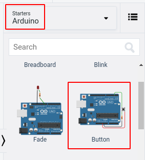
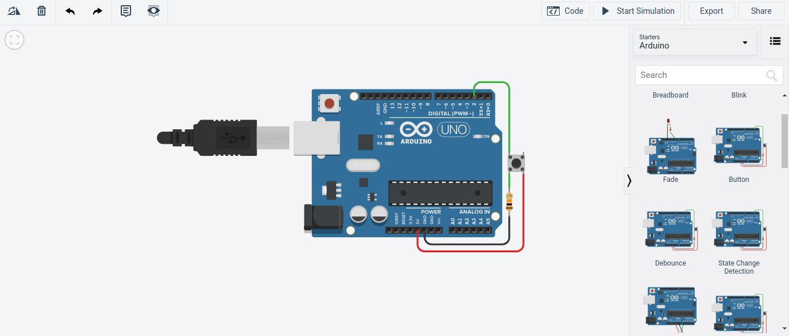
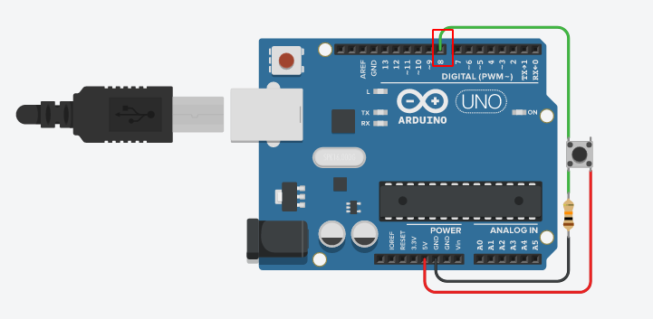
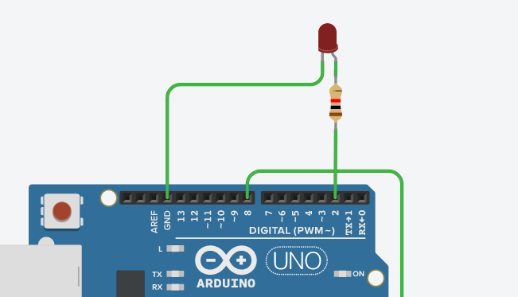
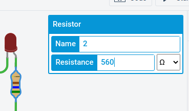
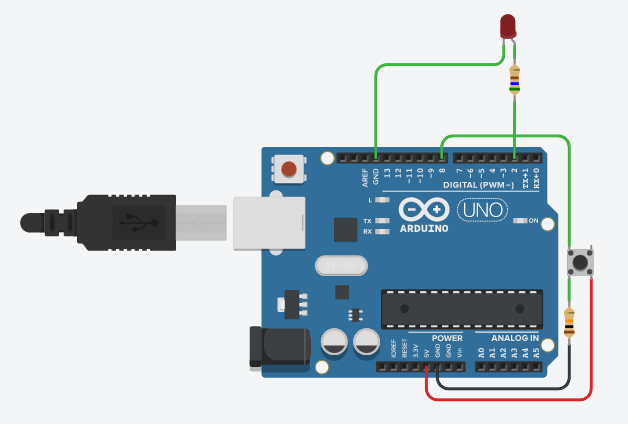
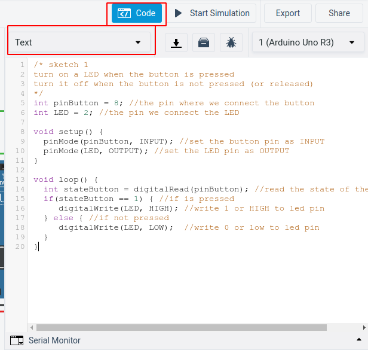
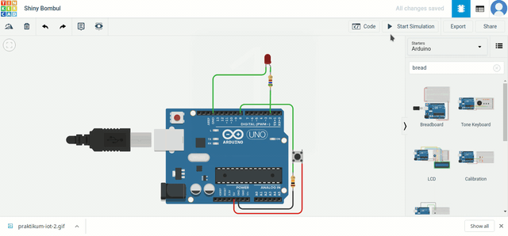

Tinkercad adalah sebuah *tool online* yang dapat kita gunakan untuk membuat rangkaian elektronika dan mensimulasikannya.  Tutorial ini akan membuat rangkaian untuk menyalakan LED menggunakan *switch button* dan Arduino menggunakan Tinkercad. Pada tutorial kali ini pin input pada Arduino akan kita konfigurasi sebagai INPUT sehingga membutuhkan resistor *pull up* atau *pull down*.


## Persiapan

Untuk mengikuti tutorial ini, kamu perlu memiliki akun Tinkercad. Jika kamu seorang pelajar/mahasiswa kamu bisa mendaftar secara gratis menggunakan email sekolah atau kampus. Daftar akun AutoDesk Education melalui tautan berikut: [daftar akun AutoDesk Education](https://accounts.autodesk.com/register?viewmode=iframe&ReturnUrl=%2Fauthorize%3Fviewmode%3Diframe%26lang%3Den%26uitype%3Deducation%26realm%3Dwww.autodesk.com%26ctx%3Ddotcom%26AuthKey%3D1772329e-0cc7-4f87-bb1d-cd2e3aa9f879).

Tutorial ini bisa juga kamu ikuti menggunakan komponen-komponen asli secara fisik. Berikut ini adalah komponen-komponen yang diperlukan:

- Board Arduino
- Switch Button
- Resistor 560 ohm dan 10k ohm
- Lampu LED

Untuk menuliskan kode Arduino kamu bisa menggunakan Arduino IDE yang dapat kamu unduh melalui tautan berikut: [unduh Arduino IDE](https://www.arduino.cc/en/Main/Software). Jika kamu menggunakan Tinkercad maka tidak perlu mengunduh Arduino IDE.


## Skematik



## Merangkai Komponen

1. Buka dashboard TInkercad, lalu buat sirkuit baru.

   

2. Kita bisa memulai dengan *starter* yang telah disediakan, di sini kita bisa memilih Arduino Starter Button.

   

3. Setelah diklik maka pada lembar kerja akan muncul rangkaian seperti berikut.

   

4. Kita perlu menyesuaikan rangkaian tersebut dengan menyambungkan *switch button* ke pin input 8.

   

5. Kemudian tambahkan LED dan resistor 560 ohm pada lembar kerja. Hubungkan kaki katoda (-) ke ground dan kaki anoda (+) ke salah satu kaki resistor 560 ohm. Kemudian hubungkan kaki resistor lainnya ke pin 2.

   

6. Untuk mengatur besarnya resistansi sebuah resistor, kita bisa klik resistor tersebut kemudian memasukkan nilai resistansinya.

   

7. Sehingga hasil rangkaiannya akan menjadi seperti berikut ini.

   


## Membuat Program

Langkah selanjutnya adalah menuliskan kode yang berfungsi untuk membaca masukkan dari *switch button* kemudian menyalakan LED berdasarkan masukkan tersebut.

```c++
/* sketch 1 
turn on a LED when the button is pressed
turn it off when the button is not pressed (or released)
*/
int pinButton = 8; //the pin where we connect the button
int LED = 2; //the pin we connect the LED

void setup() {
  pinMode(pinButton, INPUT); //set the button pin as INPUT
  pinMode(LED, OUTPUT); //set the LED pin as OUTPUT
}

void loop() {
  int stateButton = digitalRead(pinButton); //read the state of the button
  if(stateButton == 1) { //if is pressed
     digitalWrite(LED, HIGH); //write 1 or HIGH to led pin
  } else { //if not pressed
     digitalWrite(LED, LOW);  //write 0 or low to led pin
  }
}
```

Pada fungsi `setup()` kita mengatur pin 8 sebagai INPUT dan pin 2 sebagai OUTPUT. Pada fungsi `loop()` kita membaca nilai dari pin 8 dan menyimpan nilainya pada variabel `sateButton`.  Jika *swtich button* ditekan (nilai `stateButton` = 1) maka berikan tegangan pada pin 2 (`HIGH`) sehingga LED akan menyala. Jika *switch button* tidak ditekan (nilai `stateButton` tidak sama dengan 1) maka  jangan berikan tegangan pada pin 2 (`LOW`) sehingga LED akan mati.


Masukkan kode tersebut pada *Code Editor* dan pilih untuk memasukkan Teks.



Untuk menjalankan kode tersebut, kita bisa klik tombol *Start Simulation*.  
Coba tekan dan lepaskan *switch button*, kira-kira hasilnya akan seperti ini.


## Membuat LED menyala ketika *button* ditekan dan mati ketika ditekan lagi

Pada kode sebelumnya, LED akan mati secara langsung ketika *button* kita lepas. Nah, pada kode di bawah ini kita akan membuat LED menyala ketika ditekan pertama kali kemudian akan mati jika ditekan lagi.

```c++
/* sketch 2
turn on a LED when the button is pressed and let it on 
until the button is pressed again
*/
int pinButton = 8;
int LED = 2;
int stateLED = LOW;
int stateButton;
int previous = LOW;
long time = 0;
long debounce = 200;

void setup() {
  pinMode(pinButton, INPUT);
  pinMode(LED, OUTPUT);
}

void loop() {
  stateButton = digitalRead(pinButton);  
  if(stateButton == HIGH && previous == LOW && millis() - time > debounce) {
    if(stateLED == HIGH){
      stateLED = LOW; 
    } else {
       stateLED = HIGH; 
    }
    time = millis();
  }
  digitalWrite(LED, stateLED);
  previous == stateButton;
}
```

Hasilnya adalah seperti berikut ini:




## Referensi

Untuk lebih jelasnya mengenai langkah demi langkah dalam mengikuti tutorial ini, kamu bisa melihatnya di video berikut atau klik tautan ini.