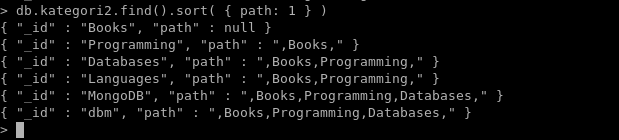

## Persiapan

Untuk melakukan tutorial ini, pastikan server lokal MongoDB sudah berjalan dengan menjalankan perintah:

```bash
ps -e| grep 'mongod'
```

Jika layanan `mongod` telah berjalan, maka kamu akan melihat informasi seperti berikut:

```
89780 ttys026    0:53.48 ./mongod
```

Jika belum berjalan, maka jalankan dengan perintah:

```bash
sudo service mongod start
```
---

## Bagian 1: Kueri Dasar untuk Pengolahan Data

1. Hubungkan ke server lokal MongoDB menggunakan mongo shell

   ```bash
   mongo
   ```

2. Setelah masuk ke mongo shell, ubah database menjadi `kampus`

   ```bash
   > use kampus
   ```

   

3. Ketika kita lihat daftar databasenya, database `kampus` belum terbuat. Hal ini dikarenakan ia belum memiliki koleksi.

   ```bash
   > show dbs
   ```

   

4. Oke, selanjutnya kita akan coba membuat koleksi `mahasiswa` dan menambahkan dokumen baru dengan nilai `nama: Adi, ipk: 3.3, jurusan: TI`.

   ```bash
   > db.mahasiswa.insert({nama: "Adi", ipk: 3.3, jurusan: "TI"})
   ```

   

5. Maka, database `kampus` akan terbuat.

   

6. Untuk menghapus koleksi `mahasiswa`, caranya adalah dengan mengetikkan perintah `db.mahasiswa.drop()`. Jika database tidak memiliki koleksi maka ia akan terhapus juga. 

   

7. Selanjutnya, kita coba kembali membuat koleksi `mahasiswa` dan menambahkan beberapa dokumen sekaligus.

   ```bash
   > db.mahasiswa.insert([{nama: "Adi", ipk: 3.3, jurusan: "TI"}, {nama: "Sundari"}, {nama: "Nur", Jurusan: "TI"}])
   ```

   

8. Untuk menampilkan semua dokumen pada koleksi `mahasiswa`, kita bisa gunakan perintah `db.mahasiswa.find()`.

   

9. Kita bisa memilih *field* mana saja yang ingin ditampilkan. Caranya adalah dengan manambahkan *key* sesuai nama *field* dan value dengan angka 1 pada argumen kedua di *method* `.find()`. Contohnya di sini kita hanya ingin menampilkan *field* `nama`, maka kuerinya adalah:

   ```bash
   > db.mahasiswa.find({}, {"nama": 1})
   ```

   

   Dengan kueri di atas, *field* `_id` masih ikut ditampilkan karena secara default ia selalu ditampilkan. Jika tidak ingin menampilkan `_id`, maka bisa mengubah kueri menjadi

   ```bash
   > db.mahasiswa.find({}, {"nama": 1, "_id": 0})
   ```

   

10. *Method* `.find()` ini hanya menerima dua argumen, yaitu:

    - `query` : untuk memfilter hasil yang ingin ditampilkan berdasarkan kondisi tertentu, dan

    - `projection` : untuk menentukan *field* mana saja yang ingin ditampilkan
    
    Jadi, jika ada argumen ketiga yang dimasukkan seperti: `db.mahasiswa.find({}, {"nama": 1}, {"_id": 0})` , argumen tersebut tidak dianggap.
    
    
    
11. Untuk memperbaraui dokumen, kita bisa menggunakan operator `$set`. Contohnya di sini kita akan menambahkan *field* `ipk` ke dalam dokumen yang memiliki nama `Sundari`.

    ```bash
    > db.mahasiswa.update({nama: "Sundari"}, {$set: {ipk: 3.5}})
    ```

    

12. Oke, selanjutnya kita bisa membuat data yang ditampilkan bisa lebih rapi. Caranya adalah dengan menambahkan *method* `.pretty()` seperti berikut ini:

    ```bash
    > db.mahasiswa.find({"nama": "Sundari"}).pretty()
    ```

    

13. Untuk menghapus dokumen, kita bisa menggunakan *method* `.remove()`. Contohnya di sini dokumen dengan nama `Sundari` akan kita hapus.

    ```bash
    > db.mahasiswa.remove({nama: "Sundari"})
    ```

    

14. Selanjutnya, kita bisa menampilkan semua dokumen dalam bentuk json dengan cara seperti berikut:

    ```bash
    > db.mahasiswa.find().forEach(printjson)
    ```

    

15. Tambahkan kembali dokumen dengan nilai `nama = Sundari, ipk = 3.5, jurusan = Ti`.

    ```bash
    > db.mahasiswa.insert({nama: "Sundari", ipk: 3.5, jurusan: "TI"})
    ```

    

16. Selanjutnya, kita akan mencoba menambahkan dokumen baru dengan nilai `_id = 4, nama = "Smith" `

    ```bash
    > db.mahasiswa.insert({_id: 4, nama: "Smith"})
    > db.mahasiswa.find().forEach(printjson)
    ```

    

17. Tambahkan *field* ipk dan jurusan pada dokumen dengan nama `Smith`.

    ```bash
    > db.mahasiswa.update({nama: "Smith"}, {$set: {ipk: 2.0, jurusan: "TI"}})
    ```

    

18. Oke, selanjutnya kita akan mencoba menampilkan dokumen-dokumen dengan nilai ipk di atas 3.3.

    ```bash
    > db.mahasiswa.find({ipk: {$gt: 3.3}}).forEach(printjson)
    ```

    

19. Mencoba menampilkan semua dokumen dengan nilai ipk di bawah 3.5.

    ```bash
    > db.mahasiswa.find({ipk: {$lt: 3.5}}).forEach(printjson)
    ```

    

20. Menampilkan dua dokumen teratas menggunakan *method* `.limit()`.

    ```bash
    > db.mahasiswa.find().limit(2).forEach(printjson)
    ```

    

21. Kita bisa mengurutkan dokumen yang ingin ditampilkan menggunakan *method* `.sort()`. Contohnya di sini kita akan mengurutkan dokumen berdasarkan ipk yang paling besar.

    ```bash
    > db.mahasiswa.find().sort({ipk: -1}).forEach(printjson)
    ```

    

22. Untuk menghitung jumlah dokumen pada koleksi `mahasiswa` kita bisa menggunakan kueri berikut ini.

    ```bash
    > db.mahasiswa.count()
    ```

    

23. Selanjutnya, kita akan mencoba memperbarui dokumen dengan nama `Smith` untuk menambahkan data ipk dan jurusan.

    ```bash
    > db.mahasiswa.update({nama: 'Smith'}, {$set: {ipk: 2.0, jurusan: "TI"}})
    ```

    

24. Kemudian, tampilkan semua dokumen pada koleksi `mahasiswa` dan urutkan berdasarkan ipk dari yang paling kecil (*ascending*).

    ```bash
    > db.mahasiswa.find().sort({ipk: 1}).forEach(printjson)
    ```

    

25. Berikut ini adalah untuk menampilkan semua dokumen dengan nilai ipk kurang dari atau sama dengan 3.5

    ```bash
    > db.mahasiswa.find({ipk: {$lte: 3.5}})
    ```

    

26. Berikut ini adalah untuk menampilkan semua dokumen dengan nilai ipk lebih dari atau sama dengan 3.3

    ```bash
    > db.mahasiswa.find({ipk: {$gte: 3.3}})
    ```

    

27. Selanjutnya, kita akan memperbarui dokumen dengan nama `Nur` untuk memiliki ipk 2.75.

    ```bash
    > db.mahasiswa.update({nama: "Nur"}, {$set: {ipk: 2.75}})
    ```

    

28. Sekarang, kita akan mencoba menampilkan semua dokumen yang memiliki ipk di antara 2.0 hingga 3.5.

    ```bash
    > db.mahasiswa.find({ipk: {$lt: 3.5, $gt: 2.0}})
    ```

    

29. Terakhir, kita akan mencoba menampilkan dokumen yang memiliki ipk 3.3 atau 3.5.

    ```bash
    > db.mahasiswa.find({$or: [{ipk: 3.3}, {ipk: 3.5}]})
    ```

    

---

## Bagian 2: Reference Document

Pada bagian kedua ini kita akan mencoba berbagai bentuk relasi antar dokumen pada MongoDB.

### Relasi *one to one*

Terdapat dua obyek, yaitu:

```json
{
    _id: "Joe",
    name: "Joe Bookreader"
}
```

```json
{
    patron_id: "joe",
    street: "123 Fake Street",
    city: "Faketon",
    state: "MA",
    zip: "12345"
}
```

Kita akan masukkan obyek yang kedua sebagai *embedded collection* pada *field* `address` untuk obyek pertama. Di sini kita gunakan koleksi `relasi` di database `praktikum`. Sehingga kuerinya akan seperti ini:

```bash
> use praktikum
> db.relasi.insert({_id: "Joe", name: "Joe Bookreader", address: {street: "123 Fake Street", city: "Faketon", state: "MA", zip: "12345"}})
```


### Relasi *one to many*

Jika sebuah obyek memiliki lebih dari satu alamat maka kita bisa menambahkan *field* misalkan bernama `addresses` untuk menyimpan alamat-alamat tersebut. Contohnya di sini, `Joe` memiliki dua alamat yaitu:

```json
{
    patron_id: "joe",
    street: "123 Fake Street",
    city: "Faketon",
    state: "MA",
    zip: "12345"
}
```

dan

```json
{
    patron_id: "joe",
    street: "1 Some other street",
    city: "Boston",
    state: "MA",
    zip: "12345"
}
```


Kueri untuk menyimpan data-data alamat tersebut adalah:

```bash
db.relasi2.insert({
	_id: "Joe", 
	name: "Joe Bookreader", 
	addresses: [
		{
			street: "123 Fake Street",
			city: "Faketon",
			state: "MA",
			zip: "12345"
		},
		{
			street: "1 Some other street",
			city: "Boston",
			state: "MA",
			zip: "12345"
		}
	]
  })
```


Hasilnya:


### Struktur Pemodelan Data *Tree*


Gambar di atas adalah contoh model data berbentuk pohon. Untuk merepresentasikan model data pohon pada MongoDB, terdapat beberapa cara yaitu: *parent reference*, *child reference*, menggunakan *array of ancestors*, dan menggunakan *materialized path*.

- #### Parent Reference

  Dengan teknik *parent reference* kita memasukkan id dokumen  yang menjadi parent dari dokumen tersebut ke dalam *field* `parent`. Contohnya adalah perintah berikut ini:

  ```bash
  > db.category.insert({ _id: "MongoDB", parent: "Databases"})
  ```

  Perintah di atas akan memasukkan sebuah dokumen baru ke dalam koleksi `category` dengan id dokumen `MongoDB` dan parentnya adalah `Databases`.

  Selanjutnya, kita buat semua dokumen supaya merepresentasikan model data seperti pada gambar di atas.

  ```bash
  > db.category.insert({ _id: "MongoDB", parent: "Databases"})
  > db.category.insert({ _id: "dbm", parent: "Databases"})
  > db.category.insert({ _id: "Databases", parent: "Programming"})
  > db.category.insert({ _id: "Languages", parent: "Programming"})
  > db.category.insert({ _id: "Programming", parent: "Books"})
  > db.category.insert({ _id: "Books", parent: null})
  ```

  

- #### Child Reference

  Teknik yang kedua adalah dengan menyimpan dokumen-dokumen yang menjadi anak dari dokumen tersebut. Caranya dengan menyimpan id dokumen-dokumen tersebut pada *field* `children` seperti perintah-perintah berikut ini.

  ```bash
  > db.categories.insert({_id: "MongoDB", children: []}) // MongoDB berada di paling bawah, karena tidak memiliki anak
  > db.categories.insert({_id: "dbm", children: []}) // dbm berada di paling bawah, karena tidak memiliki anak
  > db.categories.insert({_id: "Databases", children: ["MongoDB", "dbm"]}) // Databases memiliki dua anak yaitu MongoDB dan dbm.
  > db.categories.insert({_id: "Languages", children: []}) // Languages berada di paling bawah, karena tidak memiliki anak
  > db.categories.insert({_id: "Programming", children: ["Databases", "Languages"]}) // Programming memiliki dua anak yaitu Databases dan Languages
  > db.categories.insert({_id: "Books", children: ["Programming"]}) // Books berada di atas Programming.
  ```

  Oke, sekarang kita akan coba menampilkan anak-anak dari `Databases`.

  ```
  > db.categories.findOne({_id: "Databases"}).children
  ```

  

  Selanjutnya, kita coba menampilkan dokumen-dokumen yang memiliki children `MongoDB`

  ```bash
  > db.categories.find({children: "MongoDB"})
  ```

  

  

- Menggunakan *Array of Ancestors*

  Teknik *Arry of Ancestors* ini menyimpan nama-nama dokumen yang menjadi leluruhnya pada field `ancestors`. Selain itu, dokumen juga menyimpan referensi ke bapaknya pada *field* `parent`.

  Kita bisa menggunakan `insertMany` supaya bisa menyimpan banyak dokumen sekaligus.

  ```bash
  db.kategori.insertMany( [
    { _id: "MongoDB", ancestors: [ "Books", "Programming", "Databases" ], parent: "Databases" },
    { _id: "dbm", ancestors: [ "Books", "Programming", "Databases" ], parent: "Databases" },
    { _id: "Databases", ancestors: [ "Books", "Programming" ], parent: "Programming" },
    { _id: "Languages", ancestors: [ "Books", "Programming" ], parent: "Programming" },
    { _id: "Programming", ancestors: [ "Books" ], parent: "Books" },
    { _id: "Books", ancestors: [ ], parent: null }
  ] )
  ```

  Kueri untuk menampilkan leluhur atau jalur sebuah node dengan cepat dan mudah:

  ```bash
  > db.kategori.findOne( { _id: "MongoDB" } ).ancestors
  ```

  

  Kamu bisa membuat kueri berdasarkan leluhur bidang untuk menemukan semua turunannya. Misalkan di sini kita akan menampilkan semua dokumen yang memiliki ancestor `Programming`.

  ```bash
  > db.kategori.find( { ancestors: "Programming" } )
  ```

  

  

- Menggunakan *Materialized Path*

  Teknik *Materialized Path* ini menyimpan jalur/path pada field `path`. Nilai string `path` menggunakan tanpa pemisah koma `,`.

  Kita bisa menggunakan `insertMany` supaya bisa menyimpan banyak dokumen sekaligus.

  ```bash
  db.kategori2.insertMany( [
     { _id: "Books", path: null },
     { _id: "Programming", path: ",Books," },
     { _id: "Databases", path: ",Books,Programming," },
     { _id: "Languages", path: ",Books,Programming," },
     { _id: "MongoDB", path: ",Books,Programming,Databases," },
     { _id: "dbm", path: ",Books,Programming,Databases," }
  ] )
  ```

  Kita dapat membuat kueri untuk mengambil seluruh pohon dan mengurutkannya berdasarkan jalur bidang:

  ```bash
  > db.kategori2.find().sort( { path: 1 } )
  ```

  

  Kita dapat menggunakan *regular expression* di *field* `path` untuk menemukan turunan dari `Programming`:

  ```bash
  > db.kategori2.find( { path: /,Programming,/ } )
  ```

  

  Kita juga dapat mengambil turunan `Books` di mana `Books` berada di tingkat paling atas dari hierarki:

  ```bash
  > db.kategori2.find( { path: /^,Books,/ } )
  ```

  

---

## Latihan

Disediakan sebuah data dalam bentuk tabel seperti berikut ini:


Masukkan data tabel tersebut ke dalam koleksi `mahasiswa` pada database `latihan` di MongoDB. Setelah itu kerjakan perintah-perintah berikut:

- Mengubah data angkatan dari mahasiswa yang bernama fida menjadi angkatan 2003
- Mengubah data ipk dari mahasiswa yang bernama mahda menjadi 3.6
- Menampilkan Data Angkatan 2001 dan 2002
- Menampilkan Data IPK dan Nama Mahasiswa Angkatan 2003
- Menampilkan Data IPK dan Nama yang memiliki ipk 3.3
- Menampilkan Data IPK , Nama,  dan Angkatan yang memiliki nilai IPK antara 2.5 samapai dengan 3.5
- Menampilkan Jumlah dokumen dari Mahasiswa 
- Menampilkan Jumlah dokumen dari Mahasiswa yang ipk nya diatas 3.5
- Menampilkan 2 data Mahasiswa yang memiliki ipk 3.3
- Menampilkan Data IPK , Nama,  dan Angkatan yang memiliki nilai IPK antara 2.5 samapai dengan 3.5 diurutkaan berdasarkan angkatan 2003 hingga 2001

---

## Jawaban Latihan

1. Memasukkan data tabel ke dalam MongoDB

   ```bash
   > use latihan // menggunakan database latihan
   > db.mahasiswa.insertMany([
      {
         "nama":"bima",
         "ipk":3.2,
         "jurusan":"TI",
         "angkatan":2001
      },
      {
         "nama":"sinta",
         "ipk":3.0,
         "jurusan":"TI",
         "angkatan":2001
      },
      {
         "nama":"mahda",
         "ipk":3.5,
         "jurusan":"TI",
         "angkatan":2001
      },
      {
         "nama":"rahma",
         "ipk":3.7,
         "jurusan":"TI",
         "angkatan":2002
      },
      {
         "nama":"huda",
         "ipk":3.3,
         "jurusan":"TI",
         "angkatan":2002
      },
      {
         "nama":"septian",
         "ipk":3.0,
         "jurusan":"TI",
         "angkatan":2002
      },
      {
         "nama":"made",
         "ipk":3.8,
         "jurusan":"TI",
         "angkatan":2003
      },
      {
         "nama":"fauzan",
         "ipk":2.9,
         "jurusan":"TI",
         "angkatan":2003
      },
      {
         "nama":"fida",
         "ipk":2.8,
         "jurusan":"TI",
         "angkatan":2002
      },
      {
         "nama":"madya",
         "ipk":3.2,
         "jurusan":"TI",
         "angkatan":2003
      }
   ])
   ```

   

2. Mengubah data angkatan dari mahasiswa yang bernama fida menjadi angkatan 2003

   

3. Mengubah data ipk dari mahasiswa yang bernama mahda menjadi 3.6

   

4. Menampilkan Data Angkatan 2001 dan 2002

   

5. Menampilkan Data IPK dan Nama Mahasiswa Angkatan 2003

   

6. Menampilkan Data IPK dan Nama yang memiliki ipk 3.3

   

7. Menampilkan Data IPK , Nama,  dan Angkatan yang memiliki nilai IPK antara 2.5 sampai dengan 3.5

   

8. Menampilkan Jumlah dokumen dari Mahasiswa 

   

9. Menampilkan Jumlah dokumen dari Mahasiswa yang ipk nya diatas 3.5

   

10. Menampilkan 2 data Mahasiswa yang memiliki ipk 3.3

    

11. Menampilkan Data IPK , Nama,  dan Angkatan yang memiliki nilai IPK antara 2.5 sampai dengan 3.5 diurutkaan berdasarkan angkatan 2003 hingga 2001

    
