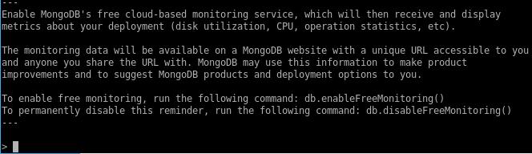
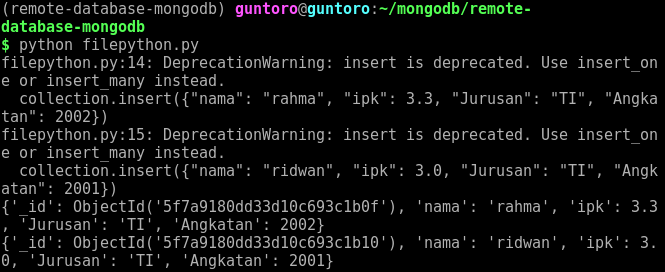
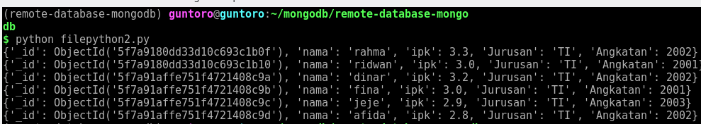
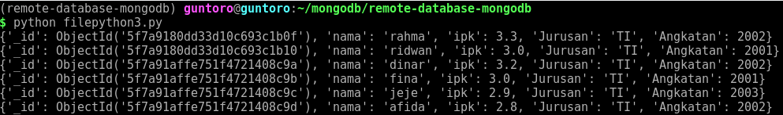
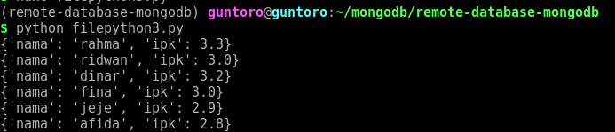
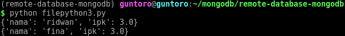
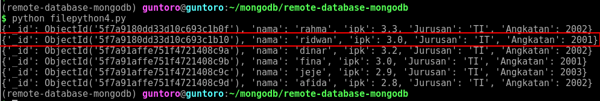
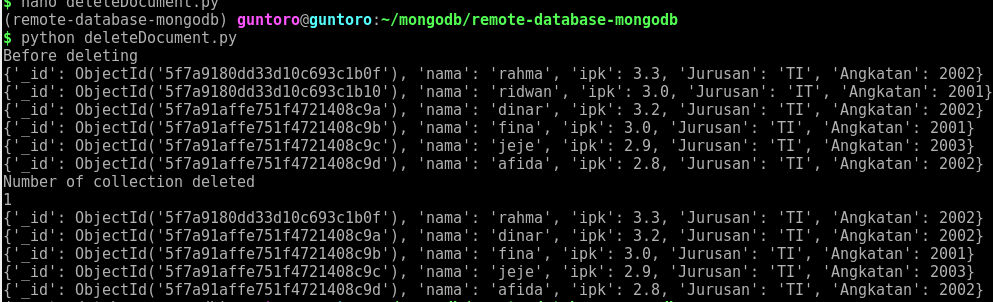
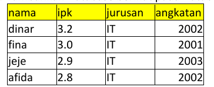
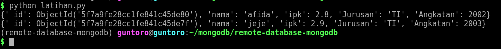

Tutorial ini akan membahas dan mempraktikan bagaimana mengakses server MongoDB secara remote.

## Persiapan

Untuk melakukan praktikum ini, perlu menyiapkan dua buah komputer. Komputer pertama berfungsi sebagai host MongoDB server dan komputer kedua sebagai client.

Di sini, saya menggunakan CentOS 6.10 pada VirtualBox untuk host MongoDB Server dan MX Linux 19.2 pada laptop sebagai client.

Berikut ini adalah pengalamatan IP nya:

```
CentOS (MongoDB Server)		: 10.10.10.20/24

MX Linux (client)			: 10.10.10.1/24
```


Mengatur firewall untuk mengizinkan akses ke port 27017 (nomor port untuk menjalankan MongoDB Server) pada komputer pertama. Di sini saya akan menggunakan ufw untuk mengatur firewall daripada iptables.

- Mematikan layanan iptables

  ```bash
  $ sudo service iptables stop
  ```

- Install ufw melalui repositori epel

  ```bash
  $ yum install epel-release -y
  $ yum install ufw -y
  ```

- Mengaktifkan ufw

  ```bash
  $ sudo ufw enable
  ```

- Menambahkan port 27017 sebagai port yang dibuka

  ```bash
  $ sudo ufw allow 27017
  ```

- Cek status ufw

  ```bash
  $ sudo ufw status verbose
  ```


Menjalankan MongoDB Server pada komputer pertama

```bash
$ sudo mongod --dbpath ~/data/mongodb/db --port 27017 --bind_ip 127.0.0.1,10.10.10.20
```


Tes koneksi ke MongoDB server dari komputer kedua (client)

```bash
$ mongo --port 10.10.10.20 --port 27017
```




## Kueri Dasar MongoDB menggunakan Python

1. Instalasi python versi 3, pip package manager, dan module venv untuk membuat virtual environment pada komputer kedua

   ```bash
   $ sudo apt install python3
   $ sudo apt install python3-pip
   $ sudo apt install python3-venv
   ```

2. Membuat virtual env menggunakan python versi 3 sehingga kedepannya kita bisa menggunakan python3 hanya dengan perintah `python` saja pada environment ini.

   ```bash
   $ python3 -m venv remote-database-mongodb
   $ source remote-database-mongodb/bin/activate # mengaktifkan virtual environment
   ```

3. Install driver pymongo untuk menghubungkan ke server MongoDB

   ```bash
   (remote-database-mongodb) $ pip install pymongo
   ```

4. Membuat file dengan nama `filepyhton.py` kemudian isi dengan kode berikut:

   ```python
   # import MongoClient module dari pymongo driver
   from pymongo import MongoClient
   
   # membuat koneksi ke MongoDB Server
   connection = MongoClient('mongodb://10.10.10.20:27017/')
   
   # mengidentifikasi database yang akan digunakan
   db = connection.kampus
   
   # mengidentifikasi koleksi yang akan digunakan
   collection = db.mahasiswa
   
   # membuat dokumen baru ke koleksi mahasiswa
   collection.insert({"nama": "rahma", "ipk": 3.3, "Jurusan": "TI", "Angkatan": 2002})
   collection.insert({"nama": "ridwan", "ipk": 3.0, "Jurusan": "TI", "Angkatan": 2001})
   
   # menampilkan semua dokumen pada koleksi mahasiswa
   for doc in collection.find():
       print(doc)
   ```

   

   Jalankan file tersebut dengan perintah:

   ```bash
   (remote-database-mongodb) $ python filepyhton.py
   ```

   

5. Selanjutnya, buat file filepython2.py yang berfungsi untuk menambahkan dokumen menggunakan method `insert_many`.

   ```python
   # import MongoClient module dari pymongo driver
   from pymongo import MongoClient
   
   # membuat koneksi ke MongoDB Server
   connection = MongoClient('mongodb://10.10.10.20:27017/')
   
   # mengidentifikasi database yang akan digunakan
   db = connection.kampus
   
   # mengidentifikasi koleksi yang akan digunakan
   collection = db.mahasiswa
   
   # membuat dokumen baru ke koleksi mahasiswa
   data=[
       {"nama": "dinar", "ipk": 3.2, "Jurusan": "TI", "Angkatan": 2002},
       {"nama": "fina", "ipk": 3.0, "Jurusan": "TI", "Angkatan": 2001},
       {"nama": "jeje", "ipk": 2.9, "Jurusan": "TI", "Angkatan": 2003},
       {"nama": "afida", "ipk": 2.8, "Jurusan": "TI", "Angkatan": 2002}
   ]
   collection.insert_many(data)
   
   # menampilkan semua dokumen pada koleksi mahasiswa
   for doc in collection.find():
       print(doc)
   ```

   

   Jalankan file tersebut dengan perintah:

   ```bash
   (remote-database-mongodb) $ python filepyhton2.py
   ```

   

   

6. Menampilkan dokumen pada koleksi mahasiswa

   Buat file filepython2.py kemudian tambahkan kode berikut:

   ```python
   # import MongoClient module dari pymongo driver
   from pymongo import MongoClient
   
   # membuat koneksi ke MongoDB Server
   connection = MongoClient('mongodb://10.10.10.20:27017/')
   
   # mengidentifikasi database yang akan digunakan
   db = connection.kampus
   
   # mengidentifikasi koleksi yang akan digunakan
   collection = db.mahasiswa
   
   # menampilkan semua dokumen pada koleksi mahasiswa
   for doc in collection.find():
       print(doc)
   
   ```

   Ketika kode tersebut dijalankan maka ia akan menampilkan semua dokumen pada koleksi mahasiswa.

   

   

   Menampilkan data dengan field tertentu.

   ```python
   # import MongoClient module dari pymongo driver
   from pymongo import MongoClient
   
   # membuat koneksi ke MongoDB Server
   connection = MongoClient('mongodb://10.10.10.20:27017/')
   
   # mengidentifikasi database yang akan digunakan
   db = connection.kampus
   
   # mengidentifikasi koleksi yang akan digunakan
   collection = db.mahasiswa
   
   # menampilkan semua dokumen pada koleksi mahasiswa
   for doc in collection.find({}, {"_id": 0, "nama": 1, "ipk": 1}):
       print(doc)
   ```

   Kode di atas berfungsi untuk menampilkan semua dokumen pada koleksi mahasiswa dengan field yang ditampilkan adalah nama dan ipk saja.

   

   

   Untuk menampilkan field dengan kondisi tertentu misalkan dokumen yang memiliki ipk 3.0, maka bisa menambahkan query pada argumen pertama pada method `.find()`.

   ```python
   ...
   
   # menampilkan semua dokumen pada koleksi mahasiswa dengan kondisi terentu
   for doc in collection.find({"ipk": 3.0}, {"_id": 0, "nama": 1, "ipk": 1}):
       print(doc)
   ```

   

   

7. Mengubah data tertentu pada koleksi mahasiswa

   Kode berikut ini adalah untuk mengubah dokumen dengan nama ridwan.

   ```python
   # import MongoClient module dari pymongo driver
   from pymongo import MongoClient
   
   # membuat koneksi ke MongoDB Server
   connection = MongoClient('mongodb://10.10.10.20:27017/')
   
   # mengidentifikasi database yang akan digunakan
   db = connection.kampus
   
   # mengidentifikasi koleksi yang akan digunakan
   collection = db.mahasiswa
   
   # update many
   updateResult = collection.update_many({"nama": "ridwan"}, {"$set": {"Jurusan": "IT"}})
   
   # menampilkan semua dokumen pada koleksi mahasiswa
   for doc in collection.find():
       print(doc)
   ```

   

   

8. Menghapus data tertentu pada koleksi mahasiswa

   Kode di bawah ini berfungsi untuk menghapus dokumen dengan nama ridwan.

   ```python
   # import MongoClient module dari pymongo driver
   from pymongo import MongoClient
   
   # membuat koneksi ke MongoDB Server
   connection = MongoClient('mongodb://10.10.10.20:27017/')
   
   # mengidentifikasi database yang akan digunakan
   db = connection.kampus
   
   # mengidentifikasi koleksi yang akan digunakan
   collection = db.mahasiswa
   
   # print before deleting
   print("Before deleting")
   for deletedDocument in collection.find():
       print(deletedDocument)
   
   # delete one record
   deleteResult = collection.delete_one({"nama": "ridwan"})
   
   print("Number of collection deleted")
   print(deleteResult.deleted_count)
   
   # print the collection after single deletion
   for doc in collection.find():
       print(doc)
   ```

   


## Latihan

Lakukan CRUD pada database MongoDB menggunakan program Python.

1. Tambahkan database berikut

   

2. Hapus dokumen dengan nama `dinar`

3. Perbarui nilai `ipk ` milik `fina` menjadi 3.3

4. Tampilkan seluruh dokumen yang memiliki nilai ipk antara 2.0 hingga 3.0 dan diurutkan berdasarkan angkatan.


## Jawaban

Berikut ini adalah kode untuk melakukan tugas pada latihan di atas

```python
# latihan.py

# import MongoClient module dari pymongo driver
from pymongo import MongoClient

# membuat koneksi ke MongoDB Server
connection = MongoClient('mongodb://10.10.10.20:27017/')

# mengidentifikasi database yang akan digunakan
db = connection.kampus

# mengidentifikasi koleksi yang akan digunakan
collection = db.latihan

# membuat dokumen baru ke koleksi latihan
data=[
    {"nama": "dinar", "ipk": 3.2, "Jurusan": "TI", "Angkatan": 2002},
    {"nama": "fina", "ipk": 3.0, "Jurusan": "TI", "Angkatan": 2001},
    {"nama": "jeje", "ipk": 2.9, "Jurusan": "TI", "Angkatan": 2003},
    {"nama": "afida", "ipk": 2.8, "Jurusan": "TI", "Angkatan": 2002}
]
collection.insert_many(data)

# menghapus dokumen dengan nama dinar
deletedResult = collection.delete_one({"nama": "dinar"})

# memperbarui nilai ipk fina menjadi 3.3
updatedResult = collection.update_one({"nama": "fina"}, {"$set": {"ipk": 3.3}})

# menampilkan dokumen dengan ipk antara 2.0 dan 3.0 dan diurutkan dari angkatan yang paling awal
for doc in collection.find({"ipk": {"$gt": 2.0, "$lt": 3.0}}).sort("Angkatan", 1):
    print(doc)
```

