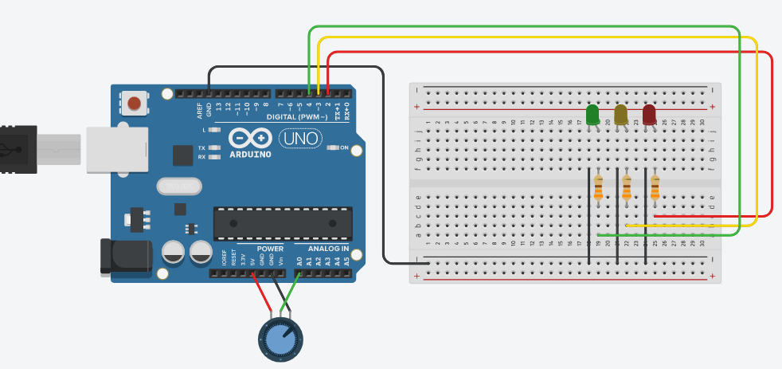
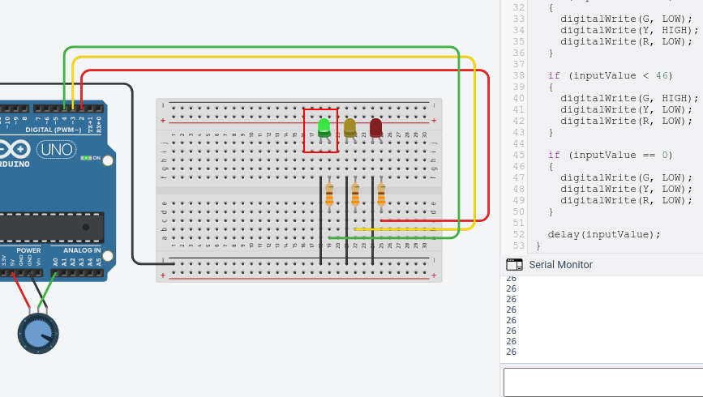
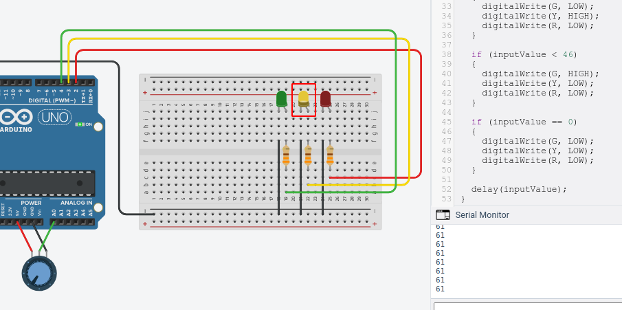
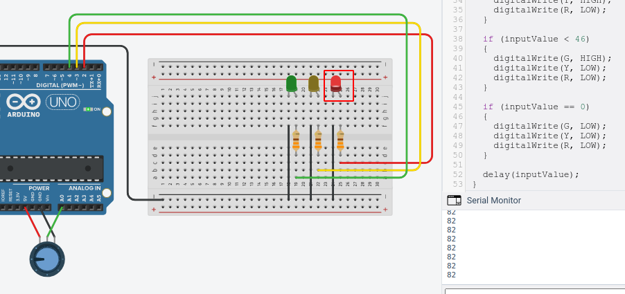
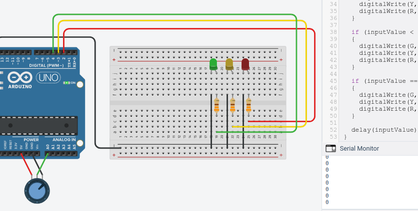

Pada tutorial kali ini, kita akan menggunakan tiga buah lampu LED berwarna hijau, kuning, dan merah. Kemudian kita akan membaca input secara analog dari potensiometer menggunakan board arduino.  Nilai input dari potensiometer tersebut akan kita gunakan sebagai parameter untuk menyalakan lampu-lampu tersebut dengan ketentuan:

- Jika nilainya  1 sampai 45, maka lampu hijau akan menyala. 
- Jikai nilainya 46 sampai 75, maka lampu kuning akan menyala.
- Jika nilainya lebih dari 76, maka lampu merah akan menyala.
- Jika nilainya 0, maka semua lampu akan mati.


## Persiapan

Untuk mengikuti tutorial ini, kamu perlu memiliki akun Tinkercad. Jika kamu seorang pelajar/mahasiswa kamu bisa mendaftar secara gratis menggunakan email sekolah atau kampus. Daftar akun AutoDesk Education melalui tautan berikut: [daftar akun AutoDesk Education](https://accounts.autodesk.com/register?viewmode=iframe&ReturnUrl=%2Fauthorize%3Fviewmode%3Diframe%26lang%3Den%26uitype%3Deducation%26realm%3Dwww.autodesk.com%26ctx%3Ddotcom%26AuthKey%3D1772329e-0cc7-4f87-bb1d-cd2e3aa9f879).

Tutorial ini bisa juga kamu ikuti menggunakan komponen-komponen asli secara fisik. Berikut ini adalah komponen-komponen yang diperlukan:

- Board Arduino
- Breadboard Mini
- LED hijau, kuning, dan merah masing-masing 1 buah
- Resistor 330 ohm sebanyak 3 buah
- Potensiometer sebanyak 1 buah
- Kabel jumper secukupnya

Untuk menuliskan kode Arduino kamu bisa menggunakan Arduino IDE yang dapat kamu unduh melalui tautan berikut: [unduh Arduino IDE](https://www.arduino.cc/en/Main/Software). 

Jika kamu menggunakan Tinkercad maka tidak perlu mengunduh Arduino IDE.


## Membuat Rangkaian

Rangkailah komponen-komponen menjadi seperti gambar di bawah ini!



Keterangan:

1. Hubungkan terminal 1 potensiometer ke ground
2. Hubungkan terminal 2 potensiometer ke power 5 volt
3. Hubungkan wiper potensiometer ke pin analog A0
4. Hubungkan kaki katoda setiap LED ke ground
5. Hubungkan kaki anoda LED hijau ke resistor kemudian sambungkan ke pin digital 4
6. Hubungkan kaki anoda LED kuning ke resistor kemudian sambungkan ke pin digital 3
7. Hubungkan kaki anoda LED merah ke resistor kemudian sambungkan ke pin digital 2 


## Menulis Kode

Pertama adalah kita mendeklarasikan terlebih dahulu pin-pin yang akan digunakan ke dalam sebuah variabel. Pin 4 kita masukkan ke variabel G untuk LED hijau, pin 3 kita masukkan ke variabel Y untuk LED kuning, pin 2 kita masukkan ke variabel R untuk LED merah, dan pin analog A0 kita masukkan ke variabel pinA0.

```c++
int G = 4;
int Y = 3;
int R = 2;

int pinA0 = A0;
```

Kita deklarasikan juga variabel `inputValue` dengan nilai awal 0 untuk menyimpan nilai potensiometer.

```c++
int inputValue = 0;
```


Pada fungsi `setup()`, kita atur mode pada pin A0 menjadi mode INPUT dan pada pin 2, 3, dan 4 menjadi mode OUTPUT. Selain itu kita juga mendefinisikan data rate dalam bits per second (baud)   untuk transmisi data menggunakan serial.

```c++
void setup()
{
  pinMode(pinA0, INPUT);
  pinMode(G, OUTPUT);
  pinMode(Y, OUTPUT);
  pinMode(R, OUTPUT);
    
  Serial.begin(9600);
}
```

Selanjutnya pada fungsi `loop()` kita akan mulai membaca input dari potensiometer.  Arduino memiliki fungsi `analogRead` yang membaca nilai pada rentang 0 -1023 dan `analogWrite` pada rentang 0-255. Oleh karena itu, kita perlu menyesuaikan nilai input menjadi 0-100. Untuk melakukannya kita bisa menggunakan fungsi [`map()`](https://www.arduino.cc/reference/en/language/functions/math/map/).

```c++
void setup()
{
    inputValue = analogRead(pinA0);
	inputValue = map(inputValue,0,1023,0,100);
}
```

Nilai input dari potensiometer ini bisa kita tampilkan ke dalam serial monitor menggunakan fungsi `Serial.println()`.

```c++
void setup()
{
    ...
    
	Serial.println(inputValue);
}
```

Terakhir, kita buat kondisi menggunakan sintaks `if` untuk menentukan mana LED yang akan menyala berdasarkan nilai input dari potensiometer.

```c++
void setup()
{
  ...
      
  if (inputValue >= 76)
  {
    digitalWrite(G, LOW);
    digitalWrite(Y, LOW);
    digitalWrite(R, HIGH);
  }
  
  if (inputValue < 76)
  {
    digitalWrite(G, LOW);
    digitalWrite(Y, HIGH);
    digitalWrite(R, LOW);
  }
  
  if (inputValue < 46)
  {
    digitalWrite(G, HIGH);
    digitalWrite(Y, LOW);
    digitalWrite(R, LOW);
  }
  
  if (inputValue == 0)
  {
    digitalWrite(G, LOW);
    digitalWrite(Y, LOW);
    digitalWrite(R, LOW);
  }
}
```


Keseluruhan kode yang kita tulis adalah seperti ini.

```c++
int G = 4;
int Y = 3;
int R = 2;

int pinA0 = A0;

int inputValue = 0;

void setup()
{
  pinMode(pinA0, INPUT);
  pinMode(G, OUTPUT);
  pinMode(Y, OUTPUT);
  pinMode(R, OUTPUT);
  Serial.begin(9600);
}

void loop()
{
  inputValue = analogRead(pinA0);
  inputValue = map (inputValue,0,1023,0,100);
  Serial.println(inputValue);
  if (inputValue >= 76)
  {
    digitalWrite(G, LOW);
    digitalWrite(Y, LOW);
    digitalWrite(R, HIGH);
  }
  
  if (inputValue < 76)
  {
    digitalWrite(G, LOW);
    digitalWrite(Y, HIGH);
    digitalWrite(R, LOW);
  }
  
  if (inputValue < 46)
  {
    digitalWrite(G, HIGH);
    digitalWrite(Y, LOW);
    digitalWrite(R, LOW);
  }
  
  if (inputValue == 0)
  {
    digitalWrite(G, LOW);
    digitalWrite(Y, LOW);
    digitalWrite(R, LOW);
  }
}
```


## Pengujian

Memutar potensiometer sehingga nilainya menjadi 26 maka LED hijau menyala.




Ketika nilainya 61, maka LED kuning yang menyala.




Ketika nilainya 82, maka LED merah menyala.




Ketika nilainya 0 maka semua LED mati.

