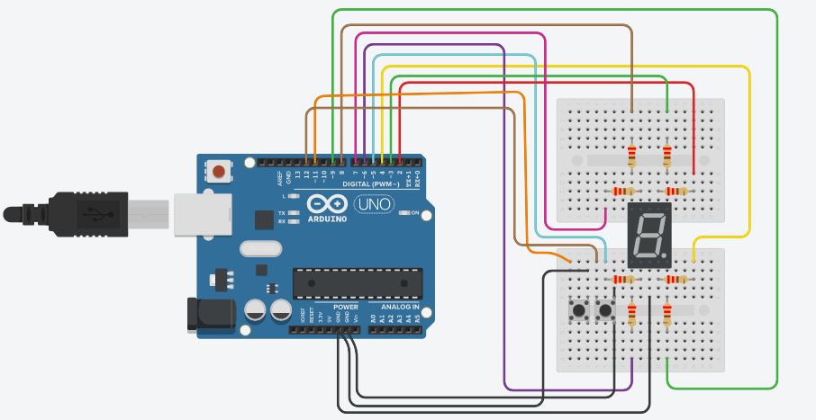

Seven Segment Display adalah komponen elektronika yang dapat menampilkan angka desimal melalui kombinasi dari tujuh segmen yang ada padanya. Setiap segmen dikendalikan secara ON dan OFF untuk menampilkan angka yang diinginkan dari 0 hingga 9. Segmen-segmen pada Seven Segmen Display di atur menjadi bentuk angka 8 dan pada beberapa jenis terdapat tambahan titik untuk menunjukkan koma pada bilangan desimal. Seven Segment Display sendiri terdapat beberapa jenis, diantaranya adalah Incandescent bulbs, Fluorescent lamps (FL), Liquid Crystal Display (LCD) dan Light Emitting Diode (LED). Jenis dari Light Emitting Diode (LED) adalah yang paling banyak dipakai.

Kemudian LED Seven Segment Display memiliki dua jenis, yaitu:

1. LED 7 Segmen tipe Common Anode

   Kaki anoda (+) pada semua kaki LED akan terhubung menjadi 1 pin yaitu pin Common.

2. LED 7 Segmen tipe Common Cathode

   Kaki katoda (-) pada semua kaki LED akan terhubung menjadi 1 pin yaitu pin Common.

Pada tutorial kali ini, kita akan membuat sebuah rangkaian untuk menampilkan angka dari 0 hingga 9 pada sebuah Seven Segment Display. Kita akan menambahkan dua buah push button yang berfungsi untuk menambahkan dan mengurangkan angka yang ditampilkan.


## Persiapan

Untuk mengikuti tutorial ini, kamu perlu memiliki akun Tinkercad. Jika kamu seorang pelajar/mahasiswa kamu bisa mendaftar secara gratis menggunakan email sekolah atau kampus. Daftar akun AutoDesk Education melalui tautan berikut: [daftar akun AutoDesk Education](https://accounts.autodesk.com/register?viewmode=iframe&ReturnUrl=%2Fauthorize%3Fviewmode%3Diframe%26lang%3Den%26uitype%3Deducation%26realm%3Dwww.autodesk.com%26ctx%3Ddotcom%26AuthKey%3D1772329e-0cc7-4f87-bb1d-cd2e3aa9f879).

Tutorial ini bisa juga kamu ikuti menggunakan komponen-komponen asli secara fisik. Berikut ini adalah komponen-komponen yang diperlukan:

- Board Arduino
- Breadboard Mini
- LED 7 Segment Display tipe Common Cathode
- Resistor 330 ohm sebanyak 3 buah
- Potensiometer sebanyak 1 buah
- Kabel jumper secukupnya

Untuk menuliskan kode Arduino kamu bisa menggunakan Arduino IDE yang dapat kamu unduh melalui tautan berikut: [unduh Arduino IDE](https://www.arduino.cc/en/Main/Software). 

Jika kamu menggunakan Tinkercad maka tidak perlu mengunduh Arduino IDE.


## Merangkai Komponen



Keterangan:

- Pin common dihubungkan ke ground
- Pin A dihubungkan ke pin 2 arduino, diantaranya tambahkan resistor
- Pin B dihubungkan ke pin 3 arduino, diantaranya tambahkan resistor
- Pin C dihubungkan ke pin 4 arduino, diantaranya tambahkan resistor
- Pin D dihubungkan ke pin 5 arduino, diantaranya tambahkan resistor
- Pin E dihubungkan ke pin 6 arduino, diantaranya tambahkan resistor
- Pin F dihubungkan ke pin 7 arduino, diantaranya tambahkan resistor
- Pin G dihubungkan ke pin 8 arduino, diantaranya tambahkan resistor
- Pin DP dihubungkan ke pin 9 arduin, diantaranya tambahkan resistoro
- Push Button pertama ke pin 11 arduino
- Push Button kedua ke pin 12 arduino


## Menulis Kode

Inisiasi variabel-variabel yang diperlukan. Variabel x0-x9 akan digunakan untuk menyimpan status angka sekarang.

```c++
int x0 = true; 
int x1, x2, x3, x4, x5, x6, x7, x8, x9;
int delay_time = 200;

int A = 2;
int B = 3;
int C = 4;
int D = 5;
int E = 6;
int F = 7;
int G = 8;
int DP = 9;
```


Selanjutnya, pada fungsi `setup()`, deklarasikan pin input dan outputnya.

```c++
void setup()
{

  // configure pin 11 & 12 as an input and enable the internal pull-up resistor
  pinMode(11, INPUT_PULLUP);
  pinMode(12, INPUT_PULLUP);

  // configura pin 2-9 as output
  pinMode(A, OUTPUT);
  pinMode(B, OUTPUT);
  pinMode(C, OUTPUT);
  pinMode(D, OUTPUT);
  pinMode(E, OUTPUT);
  pinMode(F, OUTPUT);
  pinMode(G, OUTPUT);
}
```


Pada fungsi `loop()`, kita memberikan logika jika tombol pertama yang ditekan maka akan menambah angka. Namun, jika tombol kedua yang ditekan maka angka akan berkurang.

```c++
void loop()
{
  //read the pushbutton value into a variable
  int firstButton = digitalRead(11);
  int secondButton = digitalRead(12);
  
  while (x0)
  {
    zero();
    firstButton = digitalRead(11);
    secondButton = digitalRead(12);

    if (firstButton == LOW)
    {
      x1 = true;
      x0 = false;
    }

  }

  while (x1)
  {
    one();
    firstButton = digitalRead(11);
    secondButton = digitalRead(12);

    if (firstButton == LOW)
    {
      x2 = true;
      x1 = false;
    }

    if (secondButton == LOW)
    {
      x0 = true;
      x1 = false;
    }
  }

  while (x2)
  {
    two();
    firstButton = digitalRead(11);
    secondButton = digitalRead(12);

    if (firstButton == LOW)
    {
      x3 = true;
      x2 = false;
    }

    if (secondButton == LOW)
    {
      x1 = true;
      x2 = false;
    }
  }

  while (x3)
  {
    three();
    firstButton = digitalRead(11);
    secondButton = digitalRead(12);

    if (firstButton == LOW)
    {
      x4 = true;
      x3 = false;
    }

    if (secondButton == LOW)
    {
      x2 = true;
      x3 = false;
    }
  }

  while (x4)
  {
    four();
    firstButton = digitalRead(11);
    secondButton = digitalRead(12);

    if (firstButton == LOW)
    {
      x5 = true;
      x4 = false;
    }

    if (secondButton == LOW)
    {
      x3 = true;
      x4 = false;
    }
  }

  while (x5)
  {
    five();
    firstButton = digitalRead(11);
    secondButton = digitalRead(12);

    if (firstButton == LOW)
    {
      x6 = true;
      x5 = false;
    }

    if (secondButton == LOW)
    {
      x4 = true;
      x5 = false;
    }
  }

  while (x6)
  {
    six();
    firstButton = digitalRead(11);
    secondButton = digitalRead(12);

    if (firstButton == LOW)
    {
      x7 = true;
      x6 = false;
    }

    if (secondButton == LOW)
    {
      x5 = true;
      x6 = false;
    }
  }

  while (x7)
  {
    seven();
    firstButton = digitalRead(11);
    secondButton = digitalRead(12);

    if (firstButton == LOW)
    {
      x8 = true;
      x7 = false;
    }

    if (secondButton == LOW)
    {
      x6 = true;
      x7 = false;
    }
  }

  while (x8)
  {
    eight();
    firstButton = digitalRead(11);
    secondButton = digitalRead(12);

    if (firstButton == LOW)
    {
      x9 = true;
      x8 = false;
    }

    if (secondButton == LOW)
    {
      x7 = true;
      x8 = false;
    }
  }

  while (x9)
  {
    nine();
    secondButton = digitalRead(12);
    if (secondButton == LOW)
    {
      x8 = true;
      x9 = false;
    }
  }
}
```


Kita membuat fungsi `zero()` untuk menampilkan angka 0, `one()` untuk angka 1, `two()` untuk angka 2, dan seterusnya hingga `nine()` untuk angka 9. Fungsi-fungsi inilah yang dipanggil pada fungsi  `loop()`.

```c++

void zero()
{
  for (int i = 2; i < 8; i++)
  {
    digitalWrite(i, HIGH);
    digitalWrite(G, LOW);
  }
  delay(delay_time);
}

void one()
{
  digitalWrite(A, LOW);
  digitalWrite(B, HIGH);
  digitalWrite(C, HIGH);
  digitalWrite(D, LOW);
  digitalWrite(E, LOW);
  digitalWrite(F, LOW);
  digitalWrite(G, LOW);
  delay(delay_time);
}

void two()
{
  digitalWrite(A, HIGH);
  digitalWrite(B, HIGH);
  digitalWrite(C, LOW);
  digitalWrite(D, HIGH);
  digitalWrite(E, HIGH);
  digitalWrite(F, LOW);
  digitalWrite(G, HIGH);
  delay(delay_time);
}

void three()
{
  digitalWrite(A, HIGH);
  digitalWrite(B, HIGH);
  digitalWrite(C, HIGH);
  digitalWrite(D, HIGH);
  digitalWrite(E, LOW);
  digitalWrite(F, LOW);
  digitalWrite(G, HIGH);
  delay(delay_time);
}

void four()
{
  digitalWrite(A, LOW);
  digitalWrite(B, HIGH);
  digitalWrite(C, HIGH);
  digitalWrite(D, LOW);
  digitalWrite(E, LOW);
  digitalWrite(F, HIGH);
  digitalWrite(G, HIGH);
  delay(delay_time);
}

void five()
{
  digitalWrite(A, HIGH);
  digitalWrite(B, LOW);
  digitalWrite(C, HIGH);
  digitalWrite(D, HIGH);
  digitalWrite(E, LOW);
  digitalWrite(F, HIGH);
  digitalWrite(G, HIGH);
  delay(delay_time);
}

void six()
{
  digitalWrite(A, HIGH);
  digitalWrite(B, LOW);
  digitalWrite(C, HIGH);
  digitalWrite(D, HIGH);
  digitalWrite(E, HIGH);
  digitalWrite(F, HIGH);
  digitalWrite(G, HIGH);
  delay(delay_time);
}

void seven()
{
  digitalWrite(A, HIGH);
  digitalWrite(B, HIGH);
  digitalWrite(C, HIGH);
  digitalWrite(D, LOW);
  digitalWrite(E, LOW);
  digitalWrite(F, LOW);
  digitalWrite(G, LOW);
  delay(delay_time);
}

void eight()
{
  digitalWrite(A, HIGH);
  digitalWrite(B, HIGH);
  digitalWrite(C, HIGH);
  digitalWrite(D, HIGH);
  digitalWrite(E, HIGH);
  digitalWrite(F, HIGH);
  digitalWrite(G, HIGH);
  delay(delay_time);
}

void nine()
{
  digitalWrite(A, HIGH);
  digitalWrite(B, HIGH);
  digitalWrite(C, HIGH);
  digitalWrite(D, HIGH);
  digitalWrite(E, LOW);
  digitalWrite(F, HIGH);
  digitalWrite(G, HIGH);
  delay(delay_time);
}
```


## Hasil

Untuk melihat hasilnya bisa mengakses pada link [berikut ini](https://youtu.be/6p15GvpafjM).