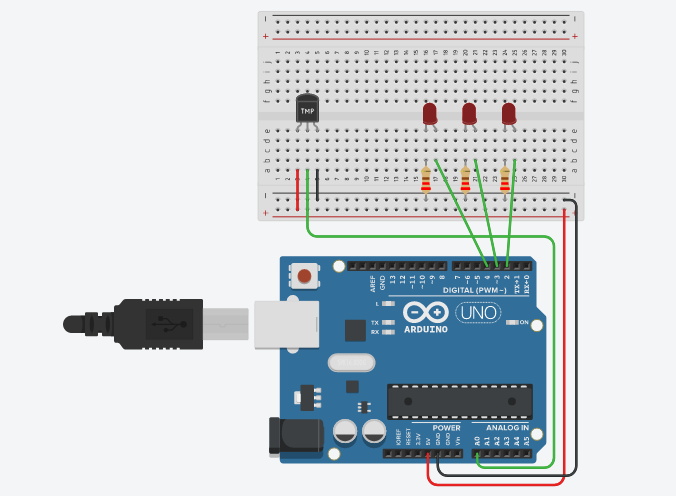
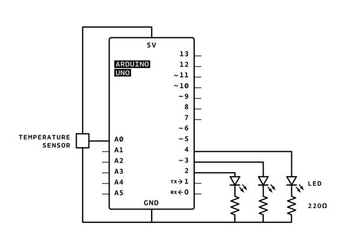

Pada tutorial ini, kita akan membuat termometer menggunakan Arduino! Menggunakan sensor suhu untuk mengukur suhu ruangan/benda kemudian mampilkannya pada Serial Monitor dan menggunakan LED sebagai indikatornya.


## Persiapan

Untuk mengikuti tutorial ini, kamu perlu memiliki akun Tinkercad. Kamu bisa langsung membuatnya di sini https://www.tinkercad.com/join.

Tutorial ini bisa juga kamu ikuti menggunakan komponen-komponen asli secara fisik. Berikut ini adalah komponen-komponen yang diperlukan:

- Board Arduino UNO
- Breadboard Mini
- Sensor Suhu TMP36
- Resistor 230 ohm sebanyak 3 buah
- LED merah sebanyak 3 buah
- Kabel jumper secukupnya

Untuk menuliskan kode Arduino kamu bisa menggunakan Arduino IDE yang dapat kamu unduh melalui tautan berikut: [unduh Arduino IDE](https://www.arduino.cc/en/Main/Software). 

Jika kamu menggunakan Tinkercad maka tidak perlu mengunduh Arduino IDE.


## Merangkai Komponen




### Memasang Sensor TMP36

Sensor TMP36 memiliki tiga buah pin. Pin paling kiri adalah pin positif (+) sehingga kita hubungkan ke pin 5v pada Arduino. Pin paling kanan adalah pin negatif (-) sehingga kita hubungkan ke pin ground pada Arduino. Sedangkan pin tengah merupakan pin output yang menghasilkan nilai suhu. Pin ini kita hubungkan ke pin analog A0 pada Arduino. Sensor TMP36 sangat mudah digunakan karena tegangan keluarannya berbanding lurus dengan suhu dalam derajat Celcius.


### Menambahkan Lampu LED

Tambahkan tiga buah lampu LED berwarna merah ke dalam rangkaian.  Pada masing-masing kaki katoda, kita hubungkan dengan resistor 200 ohm. Sedangkan masing-masing kaki anoda kita hubungkan ke pin 2, 3, dan 4 pada Arduino. Tiga buah lampu LED ini nanti akan kita gunakan sebagai indikator suhu yang terbaca dengan ketentuan:

- Jika suhu kurang dari 40 derajat celcius semua LED mati
- Jika suhu antara 40-49 derajat celcius maka satu LED akan menyala
- Jika suhu antara 50-59 derajat celcius maka dua LED akan menyala
- Jika suhu lebih dari 60 derajat celcius maka tiga LED akan menyala


## Observasi Analog Input



Pada skematik di atas, kita bisa melihat bahwa sensor suhu terhubung ke sumber daya (5 volt), ground, dan pin A0. Ketika suhu disekitar sensor naik, maka pin yang terhubung ke A0 akan meningkatkan tegangannya. Pada skematik di atas juga terlihat masing-masing LED terhubung ke pin digital 2, 3, dan 4. 

Arduino memiliki kemampuan untuk membaca atau mendapatkan informasi dari sensor analog dengan Arduino buit-in Analog-to-Digital Converter (ADC). Pin input analog A0-A5 dapat menginterpretasikan tegangan 0 dan 5V, kemudian mentranslasikannya ke nilai antara 0 sampai 1023.  

## Menulis Kode

Inisialisasi variabel-variabel untuk menyimpan batas temperatur dan nilai suhu dalam celcius dan fahrenheit.

```c
int baselineTemp = 0;
int celsius = 0;
int fahrenheit = 0;
```

Pada fungsi `setup()` , pin-pin dikonfigurasi menggunakan `pinMode()`. Pin A0 dikonfigurasi sebagai input untuk membaca nilai dari sensor suhu. Pin 2, 3, dan 4 kita atur sebagai output untuk mengontrol LED.

```c
void setup()
{
  pinMode(A0, INPUT);
  Serial.begin(9600);

  pinMode(2, OUTPUT);
  pinMode(3, OUTPUT);
  pinMode(4, OUTPUT);
}
```

Selanjutnya, pada fungsi `loop()` kita tambahkan kode untuk mengatur batas suhu menjadi 40 dan membaca nilai sensor suhu dalam celcius.

```c
void loop()
{
  // set threshold temperature to activate LEDs
  baselineTemp = 40;
  // measure temperature in Celsius
  celsius = map(((analogRead(A0) - 20) * 3.04), 0, 1023, -40, 125);
}
```

Kemudian tambahkan kode untuk mengubah suhu dari celcius menjadi fahrenheit. Rumus yang digunakan adalah F = (C * 9) / 5 * 32.

```c
void loop()
{
  ...
  // convert to Fahrenheit
  fahrenheit = ((celsius * 9) / 5 + 32);
  Serial.print(celsius);
  Serial.print(" C, ");
  Serial.print(fahrenheit);
  Serial.println(" F");

}
```

Terakhir, kita buat logika if-else untuk menyalakan lampu sesuai dengan ketentuan yang telah dituliskan di atas.

```c
void loop()
{
  ...
  if (celsius < baselineTemp) {
    digitalWrite(2, LOW);
    digitalWrite(3, LOW);
    digitalWrite(4, LOW);
  }
  if (celsius >= baselineTemp && celsius < baselineTemp + 10) {
    digitalWrite(2, HIGH);
    digitalWrite(3, LOW);
    digitalWrite(4, LOW);
  }
  if (celsius >= baselineTemp + 10 && celsius < baselineTemp + 20) {
    digitalWrite(2, HIGH);
    digitalWrite(3, HIGH);
    digitalWrite(4, LOW);
  }
  if (celsius >= baselineTemp + 20) {
    digitalWrite(2, HIGH);
    digitalWrite(3, HIGH);
    digitalWrite(4, HIGH);
  }
  delay(1000); // Wait for 1000 millisecond(s)
}
```

Sehingga, keseluruhan kode yang telah dibuat adalah:

```c
int baselineTemp = 0;
int celsius = 0;
int fahrenheit = 0;

void setup()
{
  pinMode(A0, INPUT);
  Serial.begin(9600);

  pinMode(2, OUTPUT);
  pinMode(3, OUTPUT);
  pinMode(4, OUTPUT);
}

void loop()
{
 // set threshold temperature to activate LEDs
  baselineTemp = 40;
  // measure temperature in Celsius
  celsius = map(((analogRead(A0) - 20) * 3.04), 0, 1023, -40, 125);
  
   // convert to Fahrenheit
  fahrenheit = ((celsius * 9) / 5 + 32);
  Serial.print(celsius);
  Serial.print(" C, ");
  Serial.print(fahrenheit);
  Serial.println(" F");
  
  if (celsius < baselineTemp) {
    digitalWrite(2, LOW);
    digitalWrite(3, LOW);
    digitalWrite(4, LOW);
  }
  if (celsius >= baselineTemp && celsius < baselineTemp + 10) {
    digitalWrite(2, HIGH);
    digitalWrite(3, LOW);
    digitalWrite(4, LOW);
  }
  if (celsius >= baselineTemp + 10 && celsius < baselineTemp + 20) {
    digitalWrite(2, HIGH);
    digitalWrite(3, HIGH);
    digitalWrite(4, LOW);
  }
  if (celsius >= baselineTemp + 20) {
    digitalWrite(2, HIGH);
    digitalWrite(3, HIGH);
    digitalWrite(4, HIGH);
  }
  delay(1000); // Wait for 1000 millisecond(s)
}
```


## Hasil

Untuk melihat hasilnya kita bisa melakukan simulasi pada TinkerCad seperti pada [video ini.](https://youtu.be/50FTlnDdxtM)